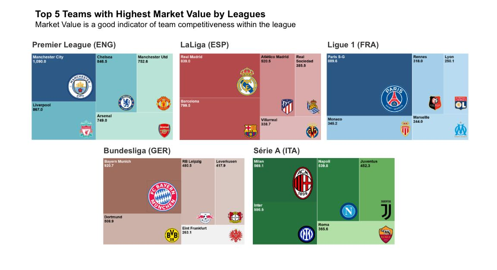
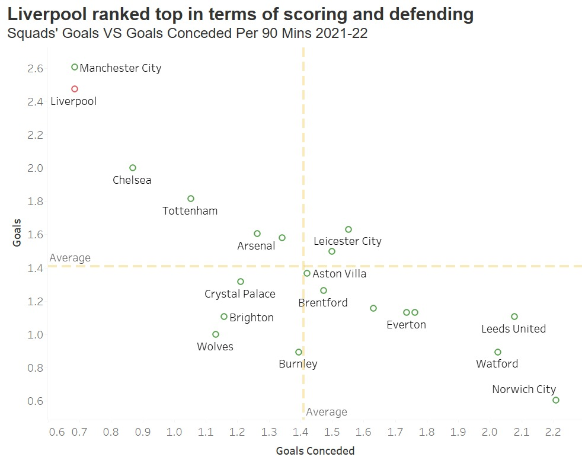
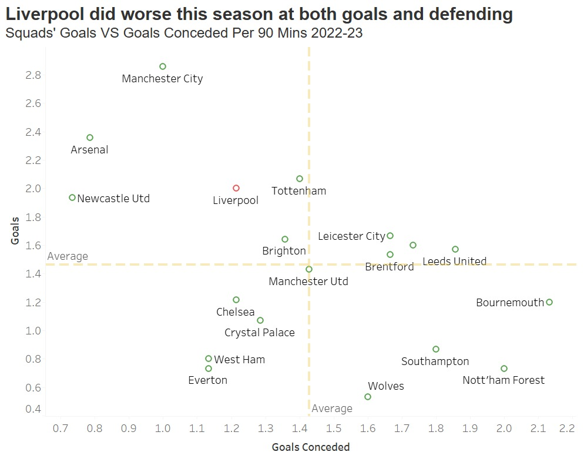
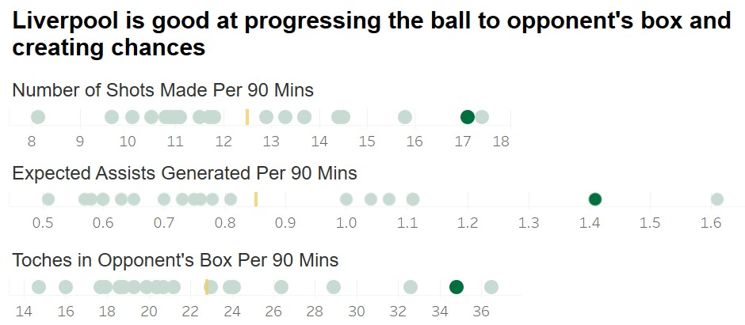
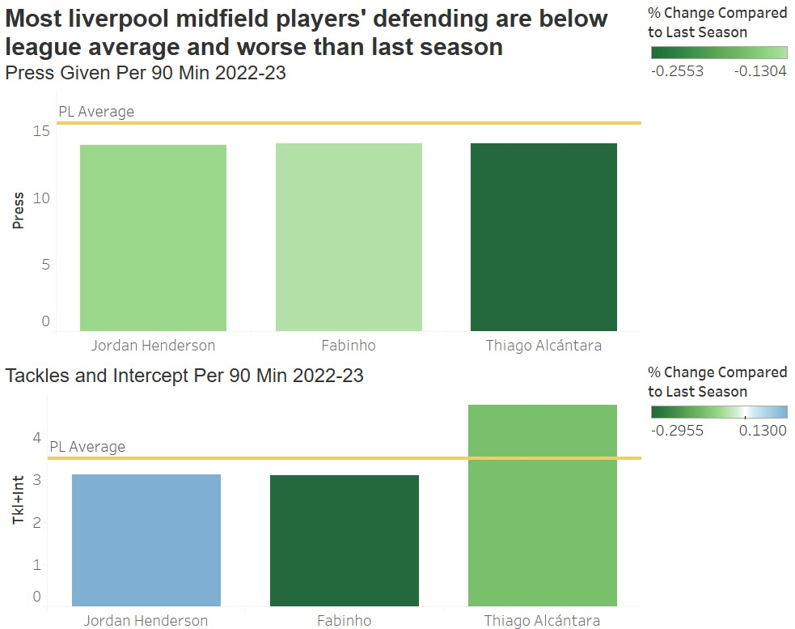
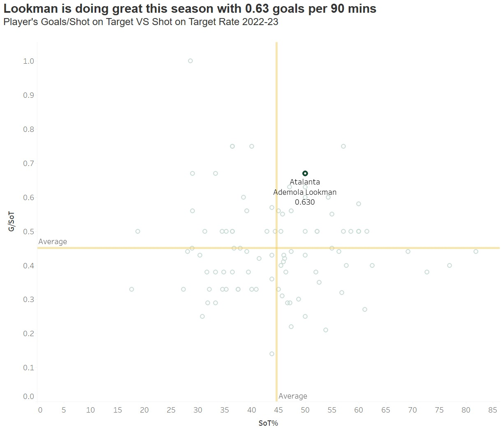
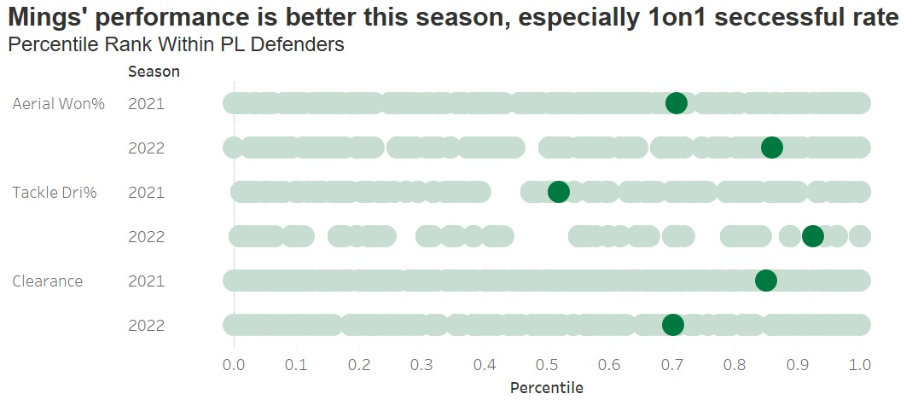

```{r setup, include=FALSE}
knitr::opts_chunk$set(echo = TRUE,warning = FALSE)
```

```{r,include=FALSE}
library(scales)
library(readr)
library(ggplot2)
library(fmsb)
library(cluster)
library(Hmisc)
library(factoextra)
library(purrr)
library(gridExtra)
library(tidyverse)
library(extrafont)
library(vroom)
library(ggtext)
library(gapminder)
library(ggrepel)
library(patchwork)
library(gghighlight)
library(skimr)
library(lubridate)
library(jpeg)
library(png)
library(patchwork)
library(maps)
library(ggstream)
library(ggmap)
library(tmap)
library(tmaptools)
library(hrbrthemes)
library(mapview)
library(viridis)
library(sf)
library(here)
library(countrycode)
library(ggspatial)
library(giscoR)
library(rasterpic)
library(rnaturalearth)
library(rnaturalearthdata)
library(rgdal)
library(rgeos)
library(ggpmisc)
library(ggridges)
library(reshape2)
library(lubridate)
library(ggforce)
library(ggflags)
library(grid)

loadfonts(device="win")
# loadfonts(device="pdf") if you have a mac

```

```{r loaddata,include=FALSE}
players_21 <- read_delim("data/2122players.csv", 
                           delim = ";", escape_double = FALSE, 
                         trim_ws = TRUE,locale = locale(encoding = "UTF-8"))
players_22 <- read_delim("data/2223players.csv", 
                         delim = ";", escape_double = FALSE, 
                         trim_ws = TRUE,locale = locale(encoding = "UTF-8"))
teams_21 <- read_delim("data/2122teams.csv", 
                         delim = ";", escape_double = FALSE, trim_ws = TRUE)
teams_22 <- read_delim("data/2223teams.csv", 
                       delim = ";", escape_double = FALSE, trim_ws = TRUE)
```

```{r cleandata, include=FALSE}
## Only choose players who play more than 900 mins in 2021 and 300 in 2022
## Clean the position column
players_21 <- players_21 %>% 
  filter(Min > 900) %>% 
  mutate(Pos = substr(Pos,1,2))

players_22 <- players_22 %>% 
  filter(Min > 300) %>% 
  mutate(Pos = substr(Pos,1,2))
```

```{r radarchart,include=FALSE}
create_beautiful_radarchart <- function(data, color = "#00AFBB", 
                                        vlabels = colnames(data), vlcex = 0.7,
                                        caxislabels = NULL, title = NULL, ...){
  radarchart(
    data, axistype = 1,seg = 2,
    # Customize the polygon
    pcol = color, pfcol = scales::alpha(color, 0.5), plwd = 1, plty = 1,pty = 32,
    # Customize the grid
    cglcol = "grey", cglty = 1, cglwd = 0.8,
    # Customize the axis
    axislabcol = "grey", 
    # Variable labels
    vlcex = vlcex, vlabels = vlabels,
    caxislabels = caxislabels, title = title, ...
  )
}
```

# Introduction

For this project, we retrieved data from [FBref](https://fbref.com/en/), our data contain Football Clubs and Players' performance stat in the Top 5 European Leagues last season and this season. To organize our study more smoothly, we also find several data such as FIFA net income and player transfer history. In this project, we dived into Premier League and studied why Liverpool's performance has been worse this season. At the end, we also implemented K-means clustering, try to identify different roles within each position.

## EDA

```{r, add player data and clean,include=FALSE}
                                      
# Combine data sets into one data set 
list_csv_files <- c("data/players/players_15.csv", "data/players/players_16.csv", "data/players/players_17.csv", "data/players/players_18.csv",
                    "data/players/players_19.csv","data/players/players_20.csv","data/players/players_21.csv", "data/players/players_22.csv")
fifa_players <- readr::read_csv(list_csv_files, id = "fifa_edit") 
fifa_players$fifa_edit = substr(fifa_players$fifa_edit,22,23)
fifa_players23 <- read_csv("data/players/players_23.csv", id = "fifa_edit") %>% 
  janitor::clean_names()
fifa_players23$fifa_edit = substr(fifa_players23$fifa_edit,22,23)

# Define leagues of interest
leagues = c("German 1. Bundesliga", "English Premier League", "Italian Serie A", "Spain Primera Division", "French Ligue 1")

# Clean data
fifa_players_clean <- fifa_players %>% 
  mutate(nationality_name = recode(nationality_name, 
                                   "Bosnia and Herzegovina" = "Bosnia and Herz.",
                                   "Brunei Darussalam" = "Brunei",
                                   "Cape Verde Islands" = "Cape Verde",
                                   "Central African Republic" = "Central African Rep.",
                                   "China PR" = "China",
                                   "Congo DR" = "Dem. Rep. Congo",
                                   "Curacao" = "Curaçao",
                                   "Czech Republic" = "Czech Rep.",
                                   "Dominican Republic" = "Dominican Rep.",
                                   "England" = "United Kingdom",
                                   "Equatorial Guinea" = "Eq. Guinea",
                                   "Faroe Islands" = "Faeroe Is.",
                                   "Guinea Bissau" = "Guinea-Bissau",
                                   "Korea Republic" = "Dem. Rep. Korea",
                                   "Macau" = "Macao",
                                   "North Macedonia" = "Macedonia",
                                   "Northern Ireland" = "Ireland",
                                   "Republic of Ireland" = "Ireland",
                                   "Saint Kitts and Nevis" = "St. Kitts and Nevis",
                                   "Scotland" = "United Kingdom",
                                   "South Sudan" = "Sudan",
                                   "Wales" = "United Kingdom",
                                   "Korea DPR" = "Korea Republic"))

FCL_countries <- fifa_players_clean %>% 
  filter(club_name == "Liverpool") %>%
  distinct(nationality_name, .keep_all = FALSE)

FCL_countries_v <- c("United Kingdom", "Belgium", "Italy", "Slovakia", "France", "Brazil", "Croatia", "Côte d'Ivoire", "Spain", "Serbia", "Germany", "Australia", "Ireland", "Hungary", "Cameroon", "Netherlands", "Estonia", "Senegal", "Austria", "Egypt", "Guinea", "Switzerland", "Algeria", "Japan", "Greece")


# Calculate number of players from each nation in Premier League
PL_n_nation <- fifa_players_clean %>% 
  filter(league_name == "English Premier League") %>% 
  distinct(sofifa_id, .keep_all = TRUE) %>% 
  select(nationality_name) %>% 
  rename(name = nationality_name) %>% 
  group_by(name) %>% 
  summarise(count = n()) %>% 
  mutate(liverpool = ifelse(name %in% FCL_countries_v, TRUE, FALSE))

```

```{r create map with player density}

# Create map of the world
map <- ne_countries(scale = "medium", returnclass = "sf") %>%
  dplyr::select(name, iso_a3, geometry) %>%
  filter(!name %in% c("Greenland", "Antarctica"))

# Create map filled with count of players per nation
players_by_country <- map %>% 
  left_join(PL_n_nation, by = "name") %>% # join map data with calculation of player count
  # Create plot
  ggplot() +
    geom_sf(mapping = aes(geometry = geometry, fill = log10(count), color = liverpool)) + 
    coord_sf(crs = "+proj=robin") +  # change coords for more accurate representation of map
    scale_color_manual(values = c("#838383", "red"), guide = "none") + # define manual colors for highlight countries of interest
    scale_fill_gradient(
    low = "#E4F2E7",
    high = '#00381F',
    na.value = "lightgrey",
    limits = c(0, 3), 
    breaks = c(0, 1, 2, 3),
    labels = c("0", "10", "100", "1000")) + # change gradient fill colours
    theme(panel.background = element_blank(), # remove background
          axis.ticks = element_blank(), # remove axis ticks
          legend.title = element_text(size = 9), # adjust legend title size
          legend.text = element_text(size = 8), # adjust legend text size
          axis.text = element_blank(), # remove axis labels
          plot.title.position = "plot", # left align title
          plot.title = element_textbox_simple(size=15)) + # change title size
  # Change labels
  labs(title = "<b><span style='color:red'> Liverpool</span> historically sourced their players from the same areas as the rest of the Premier League</span></b><br>
         <span style = 'font-size:12pt'>Representation of nationalities in the Premier League since 2015",
         fill = "Playercount",
         x = "",
         y = "") +
  xlim(-13000000,15000000) # change span of x axis

# View map
players_by_country

# Save plot
ggsave(
  plot = players_by_country,
  filename = "players_by_country.png",
  bg = "transparent"
)

```

```{r map of best teams per country}

fifa_players23_age <- fifa_players23 %>% 
  select(fifa_edit, age, club) %>%
  rename(club_name = club)

img_manninger <- readJPEG("data/manninger.jpeg", native = TRUE)

# Create plot
FCL_age_years <- fifa_players %>% 
  select(fifa_edit, age, club_name) %>%
  rbind(fifa_players23_age) %>% 
  filter(club_name == "Liverpool") %>% 
  mutate(fifa_edit = (paste0(20,fifa_edit))) %>% 
  ggplot(aes(x = fifa_edit, y = age)) + 
    geom_boxplot() +
    theme_minimal() +
    stat_summary(fun.y=mean, geom="point", shape=20, size=8, color="#6DBF7D", fill="#6DBF7D") +
    theme(panel.background = element_blank(), # remove background
          plot.title.position = "plot", # left align title
          panel.grid.minor = element_blank(), # remove minor gridlines
          panel.grid.major.x = element_blank(),  # remove major gridlines of y axis
          plot.title = element_textbox_simple(size=15)) + # change title size
    # Add arrow to highlight biggest outlier
    geom_curve(
      data = data.frame(x = 3.9, y = 36, xend = 3.05, yend = 38.5),
      mapping = aes(x = x, y = y, xend = xend, yend = yend),
      colour = "grey15",
      size = 0.5,
      curvature = -0.5,
      arrow = arrow(length = unit(2, "mm"), type = "closed"),
      inherit.aes = FALSE) +
  # Add text to highlight biggest outlier
    geom_text(
      data = data.frame(x = 5, y = 36, label = "Alexander Manninger\nGoalkeeper"),
      aes(x = x, y = y, label = label),
      colour="#2B4F34",
      family="Lato",
      hjust = 0.5,
      lineheight = .8,
      inherit.aes = FALSE) +
  # Change labels
    labs(title = "<b>The <span style='color:#6DBF7D'>average age</span> of Liverpool players has increased over time</span></b><br>
         <span style = 'font-size:12pt'>Distribution of Liverpool player age per year",
         fill = "Playercount",
         x = "Year",
         y = "Age")
  
FCL_age_years + inset_element(p = img_manninger,
                 left = 0.45,
                 bottom = 0.88,
                 right = 0.55,
                 top = 1)
```

## Transfer

```{r library}

#read csv file
data_dir <- "~/Desktop/LBS/am10-group8-football-project/data/transfer"

files <- fs::dir_ls(path = data_dir, regexp = "\\.csv$", recurse = TRUE) 
#recurse=TRUE will recursively look for files further down into any folders

#read them all in using vroom::vroom()
football_transfer <- vroom(files, id = "source")
# Use janitor to clean names, and add more variables
football_transfer_all <- football_transfer %>%
  janitor::clean_names()  

# skimr::skim() to inspect and get a feel for the data         
skim(football_transfer_all)

#create df to select only the most expensive transfer/year since 1990
top_football_transfers <- football_transfer_all %>% 
  drop_na(fee_cleaned) %>% 
  filter(year > 1999) %>% 
  group_by(year) %>% 
  slice(which.max(fee_cleaned)) %>% 
  select(year, fee_cleaned, player_name)

#create a list of the nationalities of each transfer (because the information was not available)
nationality <- c("Portugal", "France", "United Kingdom", " United Kingdom", "Ivory Coast",
                 "Ghana", "Ukraine", "Spain", "Brazil", "Portugal", "Spain", "Argentina",
                 "Brazil", "United Kingdom", "Uruguay", "Belgium", "France", "Brazil", "France", 
                 "Portugal", "Germany", "United Kingdom")

#add the nationality column to the df and convert it to iso2c codes
top_football_transfers$nationality <- nationality 
top_football_transfers$iso3 <-countrycode(top_football_transfers$nationality ,"country.name", "iso2c")
top_football_transfers$iso3  <- tolower(top_football_transfers$iso3 )

#create the annotation for the first outlier and upload the image
annotation1 <- data.frame(
   x = 2009,
   y = 110,
   label = c("Cristiano Ronaldo \n Real Madrid -> Manchester United"))
img1 <- readPNG("C:/Users/ty/Desktop/LBS/am10-group8-football-project/data/transfer/ronaldo.png")
r <- rasterGrob(img1, interpolate=TRUE)

#create the annotation for the second outlier and upload the image
annotation2 <- data.frame(
   x = 2017,
   y = 240,
   label = c("Neymar \n  Barcelona FC -> PSG"))
img2 <- readPNG("C:/Users/ty/Desktop/LBS/am10-group8-football-project/data/transfer/neymar.png")
n <- rasterGrob(img2, interpolate=TRUE)

#create the annotation for the third outlier and upload the image
annotation3 <- data.frame(
   x = 2020,
   y = 110,
   label = c("Kai Havertz \n Bayer  \n Leverkusen \n -> Chelsea "))
img3 <- readPNG("C:/Users/ty/Desktop/LBS/am10-group8-football-project/data/transfer/kai.png")
k <- rasterGrob(img3, interpolate=TRUE)


  top_football_transfers$color <- ifelse(top_football_transfers$year == "2009" | top_football_transfers$year == "2017" | top_football_transfers$year == "2020", '#2a7e19', '#825736')


v <- top_football_transfers %>%
  ggplot(aes(x = year, y = fee_cleaned))+
  #geom_bar(stat = "identity", color = 'green', fill = '#2a7e19') +
  geom_bar(stat = 'identity', aes(fill = color), width = 0.6) +
  scale_fill_manual(values=c('#2a7e19', '#C5C5C5')) +
  #add flags to the graph
  geom_flag(y = -1, aes(country = iso3), size = 50) +
  #add limits to the x and y axis
  ylim(0,300) +
  scale_x_continuous(breaks = seq(2000,2021,1))+
  #set the theme, and add the annotations 
  theme_bw()+
  theme(aspect.ratio = 10/29,
    panel.grid = element_blank(),
    legend.title = element_blank(),
    legend.text  = element_blank(),
    legend.position="none",
    panel.border = element_blank(),
    panel.background = element_blank(),
    plot.title = element_text(family = "Arial",
                              size = 60, 
                              colour = "#222222", 
                              face = 'bold',
                              hjust = 0,
                              vjust = 2),   
    plot.subtitle = element_text(family = "Arial",
                                 size = 40,
                                 face = 'plain',
                                 colour = "#222222", 
                                 hjust = 0,
                                 vjust = 2),
    axis.text = element_text( size= 40, margin = margin(t = 100)),
    axis.title = element_text(size = 40)) +
    geom_text(data=annotation1, 
              aes(x=x, y =y, label=label),                 , 
              color="black", 
              size=15 , 
              angle=0, 
              fontface="bold") +
    annotation_custom(grob = r, 
                      xmin = 2008, 
                      xmax = 2010, 
                      ymin = 125, 
                      ymax = 165) +
    geom_text(data=annotation2, 
              aes( x=x, y =y,  label=label),                 , 
              color="black", 
              size=15 , 
              angle=0, 
              fontface="bold" ) +
    annotation_custom(grob = n, 
                      xmin = 2016, 
                      xmax = 2018, 
                      ymin = 250, 
                      ymax = 290) +
    geom_text(data=annotation3, 
              aes( x=x, y =y, label=label),                 , 
              color="black", 
              size=15 , 
              angle=0, 
              fontface="bold" ) +
    annotation_custom(grob = k, 
                      xmin = 2019, 
                      xmax = 2021, 
                      ymin = 140, 
                      ymax = 170) +
    labs( title = "Since 2013, the football transfer market has become more volatile compared to the early 2000's",
          subtitle = "The most expensive football transfers of each year and the player's nationalities", 
          citation = " ", 
          x = "",
          y = "Total transfer fee (€ millions)")

v

 
```

## Market Value



# Liverpool's Performance

As last year's league runner-up, Liverpool's performance slipped this season. If we look at Squad's Goal and Goals conceded data, we can observe a huge drop in both attacking and defending performance for Liverpool.





We are going to analyze the reason from player's performance in different positions.

## Attacking



In terms of Attacking, Liverpool actually did pretty good in dominating and creating chances. All 3 metrics are ranking 2nd in the league. But they only rank the fifth in terms of goals, which means they are poor at conversion rate. Both Shot on Target Rate and Goals per SoT are below league average.


## Midfield

Midfield is critical for stopping opponent's counter attack, especially for strong teams when facing weaker ones. In terms of press given, 3 main Liverpool midfield players are below the league average and did worse compared to last season. For tackles and intercept, still only Thiago is over league average and two of them did worse than last year.



## Defender

Let's look at one of the best center back in the league/the world, Virgil van Dijk's defensive performance.


In terms of aerial won and clearance, Van dijk is still one of the best players. However, his 1 on 1 defending capacity lags behind this season, which is catastrophic if a center back can't stop opponent players.

# Which role is each player playing?

On the pitch, different positions play different roles. FW are responsible for dribbling and shooting, (SoT,DriAtt,ScaDrib) MF are responsible of progress the ball and pass (ScaPassLive,PasProg,`PasTotCmp%`), DF take charge of defending (Clr, Blocks).

```{r radardata}
# Filter out GK and choose essential stats
pos_radar <- players_22 %>% 
  filter(Pos != "GK") %>% 
  select(Player,Comp,Squad,Pos,
         SoT,DriAtt,ScaDrib,
         ScaPassLive,PasProg,Touches,`PasTotCmp%`,
         Press,`Tkl+Int`, Clr, Blocks,AerWon) %>% 
  mutate(across(is.numeric, ~as.numeric(rescale(.,to = c(0,10)))))
# Calculate mean for each position
pos_mean<- pos_radar %>% 
  group_by(Pos) %>% 
  summarise(across(is.numeric,mean))
```

```{r pos_mean}

color = c("#00AFBB", "#E7B800","#FC4E07")
# Maxinmum and minmum range
data <- rbind(rep(10,13), rep(0,13), pos_mean)

# Radar chart for each position
op <- par(mar = c(1,1,1,1))
create_beautiful_radarchart(
  data = data[,-1],caxislabels = c(0,5,10),
  color = color
)
legend("topright",
       legend = data$Pos[-c(1,2)],
       bty = "n", pch = 20, col = color,
       text.col = "grey25", pt.cex = 1.5,cex = 0.8)
title(main = "Player Stat Metrics")

par(op)
```

However, even players of the same position, will have different roles. Arnold and Van Dijk are both DFs but Arnold clearly has more contribution to the attack.

```{r compare1}
# Comparison between chosen players
data<- pos_radar %>% 
  filter(Player == "Trent Alexander-Arnold" | Player == "Virgil van Dijk") %>% 
  select(-c(Comp,Squad,Pos))
color = c("#00AFBB", "#E7B800")
data <- rbind(rep(10,13), rep(0,13), data)

op <- par(mar = c(1,1,1,1))
create_beautiful_radarchart(
  data = data[,-1],caxislabels = c(0,5,10),
  color = color
)
legend("topright",
       legend = data$Player[-c(1,2)],
       bty = "n", pch = 20, col = color,
       text.col = "grey25", pt.cex = 1.5,cex = 0.8)
title(main = "Player Ability Metrics")
par(op)
```

The reason is that Arnold is right back(RB) and Van Dijk is center back(CB). The truth is that MF can also be split into attack midfield(AM) and defend midfield(DM), FW has center forward(CF) and RW/LW(Wing). But our data doesn't have this information, so we tried to use K-means clustering to see whether we can recognize those roles.

First we filter out Goalkeepers, and run a kmeans model using those stats with 3 clusters to clasify DF MF ans FW.

```{r clusterdata}
pos_feature <- players_22 %>% 
  filter(Pos != "GK") %>% 
  select(Player,Comp,Squad,Pos,
         SoT,DriAtt,ScaDrib,
         ScaPassLive,PasProg,Touches,`PasTotCmp%`,
         Press,`Tkl+Int`, Clr, Blocks,AerWon) 
```

```{r kmeans3}
set.seed(1234)
n = 3

selected_data <- pos_feature %>%
  select(-Player,-Comp,-Squad,-Pos)
#scale the data
selected_data<-data.frame(scale(selected_data))

#train kmeans clustering
kmeans<-eclust(selected_data, "kmeans", k = n,nstart = 50,graph= FALSE)

fviz_cluster(kmeans,selected_data, palette = "Set2",geom = "point")
```

The model can clearly split out 3 positions, with several points overlapping, which may be ambiguous positions such as wing back and defensive midfield.

Then we apply clustering within each position with k = 2, and identify the corresponding position by checking the cluster centers.

## DF

```{r df,include=FALSE}
set.seed(1234)
n = 2
# Filter out DF
DF <- players_22 %>% 
  filter(Pos == "DF") %>% 
  select(Player,Comp,Squad,Pos,
         SoT,DriAtt,ScaDrib,
         ScaPassLive,PasProg,Touches,`PasTotCmp%`,
         Press,`Tkl+Int`, Clr, Blocks,AerWon) 

selected_data <- DF %>%
  select(-Player,-Comp,-Squad,-Pos)
#scale the data
selected_data<-data.frame(scale(selected_data))

#train kmeans clustering
kmeans<-eclust(selected_data, "kmeans", k = n,nstart = 50,graph= FALSE)

#add clusters to the data frame
pre_DF <- DF %>% 
  mutate(cluster = as.factor(kmeans$cluster))

cluster_centers<-data.frame(cluster=as.factor(c(1:n)),kmeans$centers)
#transpose this data frame
cluster_centers_t<-cluster_centers %>% gather(variable,value,-cluster,factor_key = TRUE)
```

```{r,df_viz}
fviz_cluster(kmeans,selected_data, palette = "Set2",geom = "point")

#plot the centers
ggplot(cluster_centers_t, aes(x = variable, y = value))+
  geom_line(aes(color =cluster,group = cluster), 
            linetype = "dashed",size=1)+
  geom_point(size=1,shape=4)+
  geom_hline(yintercept=0)+
  theme(text = element_text(size=10),
        axis.text.x = element_text(angle=45, hjust=1),)+
  ggtitle("K-means Centers k=2")

pre_DF = pre_DF %>% 
  mutate(cluster = case_when(cluster == 1 ~ "WB",
                             cluster == 2 ~ "CB"))
```

## MF

```{r mf,include=FALSE}
set.seed(1234)
n = 2
# Filter out MF
MF <- players_22 %>% 
  filter(Pos == "MF") %>% 
  select(Player,Comp,Squad,Pos,
         SoT,DriAtt,ScaDrib,
         ScaPassLive,PasProg,Touches,`PasTotCmp%`,
         Press,`Tkl+Int`, Clr, Blocks,AerWon) 

selected_data <- MF %>%
  select(-Player,-Comp,-Squad,-Pos)
#scale the data
selected_data<-data.frame(scale(selected_data))

#train kmeans clustering
kmeans<-eclust(selected_data, "kmeans", k = n,nstart = 50,graph= FALSE)

#add clusters to the data frame
pre_MF <- MF %>% 
  mutate(cluster = as.factor(kmeans$cluster))

cluster_centers<-data.frame(cluster=as.factor(c(1:n)),kmeans$centers)
#transpose this data frame
cluster_centers_t<-cluster_centers %>% gather(variable,value,-cluster,factor_key = TRUE)
```

```{r,mf_viz}
fviz_cluster(kmeans,selected_data, palette = "Set2",geom = "point")

#plot the centers
ggplot(cluster_centers_t, aes(x = variable, y = value))+
  geom_line(aes(color =cluster,group = cluster), 
            linetype = "dashed",size=1)+
  geom_point(size=1,shape=4)+
  geom_hline(yintercept=0)+
  theme(text = element_text(size=10),
        axis.text.x = element_text(angle=45, hjust=1),)+
  ggtitle("K-means Centers k=2")

pre_MF = pre_MF %>% 
  mutate(cluster = case_when(cluster == 1 ~ "AM",
                             cluster == 2 ~ "DM"))
```

## FW

```{r fw,include=FALSE}
set.seed(1234)
n = 2
# Filter out FW
FW <- players_22 %>% 
  filter(Pos == "FW") %>% 
  select(Player,Comp,Squad,Pos,
         SoT,DriAtt,ScaDrib,
         ScaPassLive,PasProg,Touches,`PasTotCmp%`,
         Press,`Tkl+Int`, Clr, Blocks,AerWon) 

selected_data <- FW %>%
  select(-Player,-Comp,-Squad,-Pos)
#scale the data
selected_data<-data.frame(scale(selected_data))

#train kmeans clustering
kmeans<-eclust(selected_data, "kmeans", k = n,nstart = 50,graph= FALSE)

#add clusters to the data frame
pre_FW <- FW %>% 
  mutate(cluster = as.factor(kmeans$cluster))

cluster_centers<-data.frame(cluster=as.factor(c(1:n)),kmeans$centers)
#transpose this data frame
cluster_centers_t<-cluster_centers %>% gather(variable,value,-cluster,factor_key = TRUE)
```

```{r, fw_viz}
fviz_cluster(kmeans,selected_data, palette = "Set2",geom = "point")

#plot the centers
ggplot(cluster_centers_t, aes(x = variable, y = value))+
  geom_line(aes(color =cluster,group = cluster), 
            linetype = "dashed",size=1)+
  geom_point(size=1,shape=4)+
  geom_hline(yintercept=0)+
  theme(text = element_text(size=10),
        axis.text.x = element_text(angle=45, hjust=1),)+
  ggtitle("K-means Centers k=2")

pre_FW = pre_FW %>% 
  mutate(cluster = case_when(cluster == 1 ~ "WF",
                             cluster == 2 ~ "CF"))
```

```{r assign_clus,include=FALSE}
# Save data for each new clustered position
pos_radar <- rbind(pre_DF,pre_FW,pre_MF) %>% 
  select(Player,Comp,Squad,cluster,
         SoT,DriAtt,ScaDrib,
         ScaPassLive,PasProg,Touches,`PasTotCmp%`,
         Press,`Tkl+Int`, Clr, Blocks,AerWon) %>% 
  mutate(across(is.numeric, ~as.numeric(rescale(.,to = c(0,10)))))
order <- c("CF","WF","AM","DM","CB","WB")
pos_mean<- pos_radar %>% 
  group_by(cluster) %>% 
  summarise(across(is.numeric,mean)) %>% 
  slice(match(order, cluster))
```

## Clustering Result

```{r pos_com}
# Radar chart between new positions
legend = c("Center Forward","Wing Forward",
           "Attacking Midfielder","Defending Midfielder",
           "Center Back", "Wing Back")

for(i in c(1,3,5)){
  data <- rbind(rep(10,13), rep(0,13), pos_mean[c(i,i+1),])
  op <- par(mar = c(1,1,1,1))
  create_beautiful_radarchart(
    data = data[,-1],caxislabels = c(0,5,10),
    color = color
  )
  legend("topright",
         legend = legend[c(i,i+1)],
         bty = "n", pch = 20, col = color,
         text.col = "grey25", pt.cex = 1.5,cex = 0.8)
  title(main = "Player Ability Metrics")
  par(op)
}
```

From the radar chart, we can compare each cluster's strength, and is pretty close to our common knowledge about what each position are good at.

```{r player_com}
# Comparison between chosen player
data<- pos_radar %>% 
  filter(Player == "Trent Alexander-Arnold" | Player == "Virgil van Dijk") %>% 
  mutate(name_pos = paste(Player,"",cluster)) %>% 
  select(-c(Comp,Squad,cluster,Player))
color = c("#00AFBB", "#E7B800")
data <- rbind(rep(10,13), rep(0,13), data)

op <- par(mar = c(1,1,1,1))
create_beautiful_radarchart(
  data = data[,-13],caxislabels = c(0,5,10),
  color = color
)
legend("topright",
       legend = data$name_pos[-c(1,2)],
       bty = "n", pch = 20, col = color,
       text.col = "grey25", pt.cex = 1.5,cex = 0.8)
title(main = "Player Ability Metrics")
par(op)
```

We can also compare Arnold and Van Dijk again and now they are classified into different positions now.

# Conclusion

We have identified the problem Liverpool is facing this season: Poor conversion rate, dropping midfielder and center back's defending performance. And we are going to recommend players for Liverpool in each position (Not from their competitors).

## Forward

Clearly they need a player with higher conversion rate.



## Defensive Midfield

```{r rec_dm}
data<- pos_radar %>% 
  filter(Player == "Fabinho" | Player == "Idrissa Gana Gueye") %>% 
  mutate(name_pos = paste(Player,"",cluster)) %>% 
  select(-c(Comp,Squad,cluster,Player))
color = c("#00AFBB", "#E7B800")
data <- rbind(rep(10,13), rep(0,13), data)

op <- par(mar = c(1,1,1,1))
create_beautiful_radarchart(
  data = data[,-13],caxislabels = c(0,5,10),
  color = color
)
legend("topright",
       legend = data$name_pos[-c(1,2)],
       bty = "n", pch = 20, col = color,
       text.col = "grey25", pt.cex = 1.5,cex = 0.8)
title(main = "Player Ability Metrics")
par(op)
```

## Center Back


