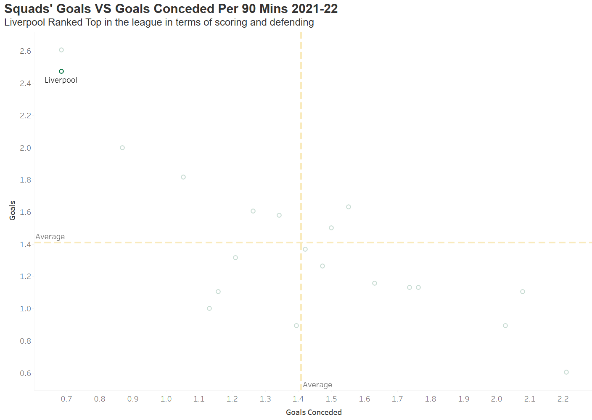
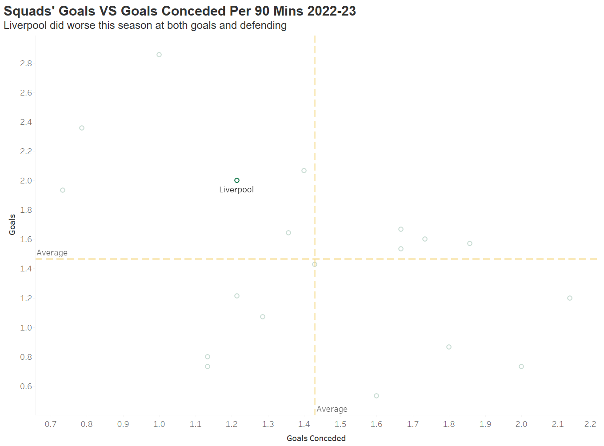
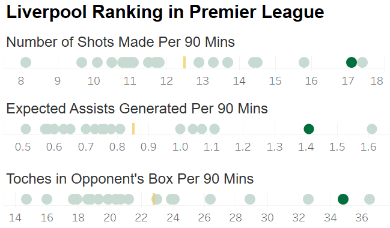
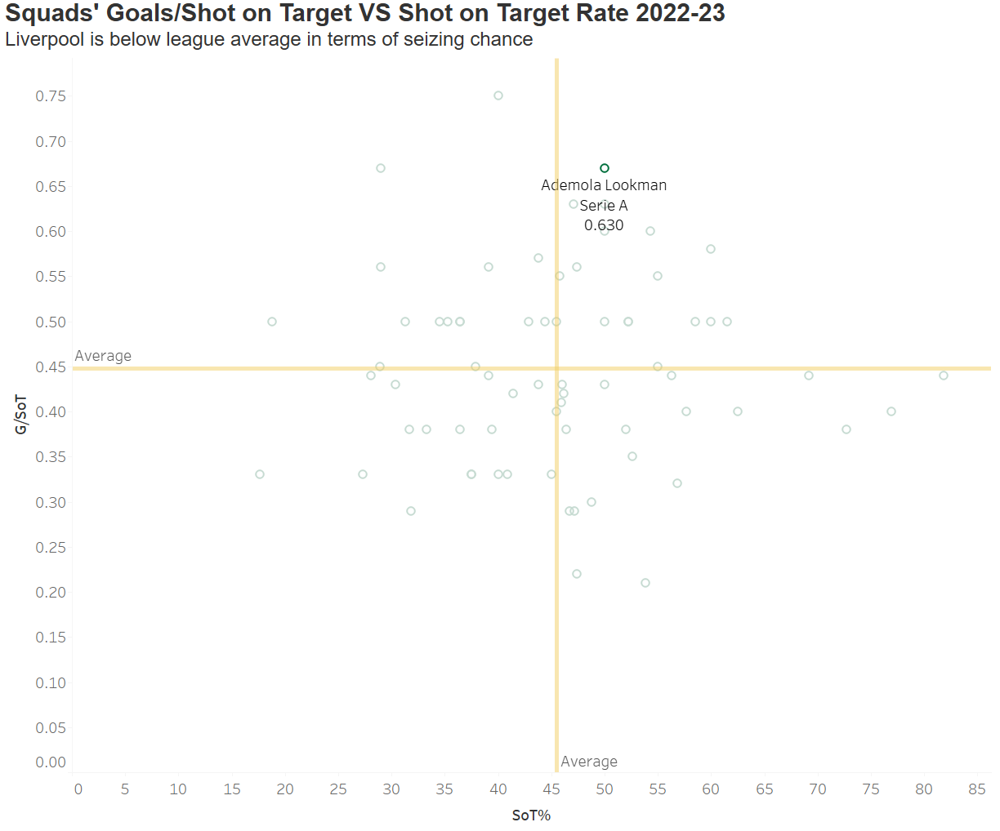
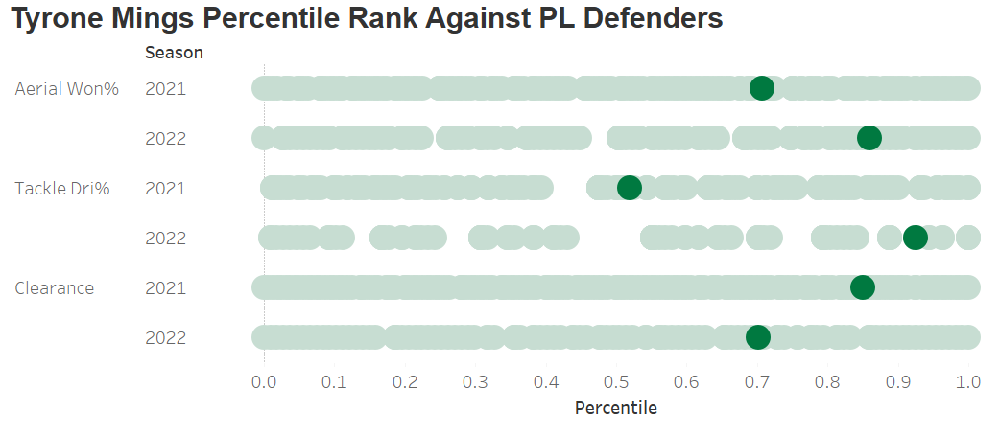

```{r setup, include=FALSE}
knitr::opts_chunk$set(echo = TRUE)
```

```{r,include=FALSE}
library(scales)
library(tidyverse)
library(readr)
library(ggplot2)
library(ggradar)
library(fmsb)
library(cluster)
library(Hmisc)
library(factoextra)
library(purrr)
library(gridExtra)

```

```{r loaddata,include=FALSE}
players_21 <- read_delim("data/2122players.csv", 
                           delim = ";", escape_double = FALSE, 
                         trim_ws = TRUE,locale = locale(encoding = "UTF-8"))
players_22 <- read_delim("data/2223players.csv", 
                         delim = ";", escape_double = FALSE, 
                         trim_ws = TRUE,locale = locale(encoding = "UTF-8"))
teams_21 <- read_delim("data/2122teams.csv", 
                         delim = ";", escape_double = FALSE, trim_ws = TRUE)
teams_22 <- read_delim("data/2223teams.csv", 
                       delim = ";", escape_double = FALSE, trim_ws = TRUE)
```

```{r cleandata, include=FALSE}
## Only choose players who play more than 900 mins in 2021 and 300 in 2022
## Clean the position column
players_21 <- players_21 %>% 
  filter(Min > 900) %>% 
  mutate(Pos = substr(Pos,1,2))

players_22 <- players_22 %>% 
  filter(Min > 300) %>% 
  mutate(Pos = substr(Pos,1,2))
```

```{r radarchart,include=FALSE}
create_beautiful_radarchart <- function(data, color = "#00AFBB", 
                                        vlabels = colnames(data), vlcex = 0.7,
                                        caxislabels = NULL, title = NULL, ...){
  radarchart(
    data, axistype = 1,seg = 2,
    # Customize the polygon
    pcol = color, pfcol = scales::alpha(color, 0.5), plwd = 1, plty = 1,pty = 32,
    # Customize the grid
    cglcol = "grey", cglty = 1, cglwd = 0.8,
    # Customize the axis
    axislabcol = "grey", 
    # Variable labels
    vlcex = vlcex, vlabels = vlabels,
    caxislabels = caxislabels, title = title, ...
  )
}
```

# Introduction

For this project, we retrieved data from [FBref](https://fbref.com/en/), our data contain Football Clubs and Players' performance stat in the Top 5 European Leagues last season and this season. To organize our study more smoothly, we also find several data such as FIFA net income and player transfer history. In this project, we dived into Premier League and studied why Liverpool's performance has been worse this season. At the end, we also implemented K-means clustering, try to identify different roles within each position.

# Liverpool's Performance

As last year's league runner-up, Liverpool's performance slipped this season. If we look at Squad's Goal and Goals conceded data, we can observe a huge drop in both attacking and defending performance for Liverpool.





We are going to analyze the reason from player's performance in different positions.

## Attacking



In terms of Attacking, Liverpool actually did pretty good in dominating and creating chances. All 3 metrics are ranking 2nd in the league. But they only rank the fifth in terms of goals, which means they are poor at conversion rate. Both Shot on Target Rate and Goals per SoT are below league average.


## Midfield

Midfield is critical for stopping opponent's counter attack, especially for strong teams when facing weaker ones. In terms of press given, 3 main Liverpool midfield players are below the league average and did worse compared to last season. For tackles and intercept, still only Thiago is over league average and two of them did worse than last year.


## Defender

Let's look at one of the best center back in the league/the world, Virgil van Dijk's defensive performance.


In terms of aerial won and clearance, Van dijk is still one of the best players. However, his 1 on 1 defending capacity lags behind this season, which is catastrophic if a center back can't stop opponent players.

# Which role is each player playing?

On the pitch, different positions play different roles. FW are responsible for dribbling and shooting, (SoT,DriAtt,ScaDrib) MF are responsible of progress the ball and pass (ScaPassLive,PasProg,`PasTotCmp%`), DF take charge of defending (Clr, Blocks).

```{r radardata}
# Filter out GK and choose essential stats
pos_radar <- players_22 %>% 
  filter(Pos != "GK") %>% 
  select(Player,Comp,Squad,Pos,
         SoT,DriAtt,ScaDrib,
         ScaPassLive,PasProg,Touches,`PasTotCmp%`,
         Press,`Tkl+Int`, Clr, Blocks,AerWon) %>% 
  mutate(across(is.numeric, ~as.numeric(rescale(.,to = c(0,10)))))
# Calculate mean for each position
pos_mean<- pos_radar %>% 
  group_by(Pos) %>% 
  summarise(across(is.numeric,mean))
```

```{r pos_mean}

color = c("#00AFBB", "#E7B800","#FC4E07")
# Maxinmum and minmum range
data <- rbind(rep(10,13), rep(0,13), pos_mean)

# Radar chart for each position
op <- par(mar = c(1,1,1,1))
create_beautiful_radarchart(
  data = data[,-1],caxislabels = c(0,5,10),
  color = color
)
legend("topright",
       legend = data$Pos[-c(1,2)],
       bty = "n", pch = 20, col = color,
       text.col = "grey25", pt.cex = 1.5,cex = 0.8)
title(main = "Player Stat Metrics")
par(op)
```

However, even players of the same position, will have different roles. Arnold and Van Dijk are both DFs but Arnold clearly has more contribution to the attack.

```{r compare1}
# Comparison between chosen players
data<- pos_radar %>% 
  filter(Player == "Trent Alexander-Arnold" | Player == "Virgil van Dijk") %>% 
  select(-c(Comp,Squad,Pos))
color = c("#00AFBB", "#E7B800")
data <- rbind(rep(10,13), rep(0,13), data)

op <- par(mar = c(1,1,1,1))
create_beautiful_radarchart(
  data = data[,-1],caxislabels = c(0,5,10),
  color = color
)
legend("topright",
       legend = data$Player[-c(1,2)],
       bty = "n", pch = 20, col = color,
       text.col = "grey25", pt.cex = 1.5,cex = 0.8)
title(main = "Player Stat Metrics")
par(op)
```

The reason is that Arnold is right back(RB) and Van Dijk is center back(CB). The truth is that MF can also be split into attack midfield(AM) and defend midfield(DM), FW has center forward(CF) and RW/LW(Wing). But our data doesn't have this information, so we tried to use K-means clustering to see whether we can recognize those roles.

First we filter out Goalkeepers, and run a kmeans model using those stats with 3 clusters to clasify DF MF ans FW.

```{r clusterdata}
pos_feature <- players_22 %>% 
  filter(Pos != "GK") %>% 
  select(Player,Comp,Squad,Pos,
         SoT,DriAtt,ScaDrib,
         ScaPassLive,PasProg,Touches,`PasTotCmp%`,
         Press,`Tkl+Int`, Clr, Blocks,AerWon) 
```

```{r kmeans3}
set.seed(1234)
n = 3

selected_data <- pos_feature %>%
  select(-Player,-Comp,-Squad,-Pos)
#scale the data
selected_data<-data.frame(scale(selected_data))

#train kmeans clustering
kmeans<-eclust(selected_data, "kmeans", k = n,nstart = 50,graph= FALSE)

fviz_cluster(kmeans,selected_data, palette = "Set2",geom = "point")
```

The model can clearly split out 3 positions, with several points overlapping, which may be ambiguous positions such as wing back and defensive midfield.

Then we apply clustering within each position with k = 2, and identify the corresponding position by checking the cluster centers.

## DF

```{r df,include=FALSE}
set.seed(1234)
n = 2
# Filter out DF
DF <- players_22 %>% 
  filter(Pos == "DF") %>% 
  select(Player,Comp,Squad,Pos,
         SoT,DriAtt,ScaDrib,
         ScaPassLive,PasProg,Touches,`PasTotCmp%`,
         Press,`Tkl+Int`, Clr, Blocks,AerWon) 

selected_data <- DF %>%
  select(-Player,-Comp,-Squad,-Pos)
#scale the data
selected_data<-data.frame(scale(selected_data))

#train kmeans clustering
kmeans<-eclust(selected_data, "kmeans", k = n,nstart = 50,graph= FALSE)

#add clusters to the data frame
pre_DF <- DF %>% 
  mutate(cluster = as.factor(kmeans$cluster))

cluster_centers<-data.frame(cluster=as.factor(c(1:n)),kmeans$centers)
#transpose this data frame
cluster_centers_t<-cluster_centers %>% gather(variable,value,-cluster,factor_key = TRUE)
```

```{r,df_viz}
fviz_cluster(kmeans,selected_data, palette = "Set2",geom = "point")

#plot the centers
ggplot(cluster_centers_t, aes(x = variable, y = value))+
  geom_line(aes(color =cluster,group = cluster), 
            linetype = "dashed",size=1)+
  geom_point(size=1,shape=4)+
  geom_hline(yintercept=0)+
  theme(text = element_text(size=10),
        axis.text.x = element_text(angle=45, hjust=1),)+
  ggtitle("K-means Centers k=2")

pre_DF = pre_DF %>% 
  mutate(cluster = case_when(cluster == 1 ~ "WB",
                             cluster == 2 ~ "CB"))
```

## MF

```{r mf,include=FALSE}
set.seed(1234)
n = 2
# Filter out MF
MF <- players_22 %>% 
  filter(Pos == "MF") %>% 
  select(Player,Comp,Squad,Pos,
         SoT,DriAtt,ScaDrib,
         ScaPassLive,PasProg,Touches,`PasTotCmp%`,
         Press,`Tkl+Int`, Clr, Blocks,AerWon) 

selected_data <- MF %>%
  select(-Player,-Comp,-Squad,-Pos)
#scale the data
selected_data<-data.frame(scale(selected_data))

#train kmeans clustering
kmeans<-eclust(selected_data, "kmeans", k = n,nstart = 50,graph= FALSE)

#add clusters to the data frame
pre_MF <- MF %>% 
  mutate(cluster = as.factor(kmeans$cluster))

cluster_centers<-data.frame(cluster=as.factor(c(1:n)),kmeans$centers)
#transpose this data frame
cluster_centers_t<-cluster_centers %>% gather(variable,value,-cluster,factor_key = TRUE)
```

```{r,mf_viz}
fviz_cluster(kmeans,selected_data, palette = "Set2",geom = "point")

#plot the centers
ggplot(cluster_centers_t, aes(x = variable, y = value))+
  geom_line(aes(color =cluster,group = cluster), 
            linetype = "dashed",size=1)+
  geom_point(size=1,shape=4)+
  geom_hline(yintercept=0)+
  theme(text = element_text(size=10),
        axis.text.x = element_text(angle=45, hjust=1),)+
  ggtitle("K-means Centers k=2")

pre_MF = pre_MF %>% 
  mutate(cluster = case_when(cluster == 1 ~ "AM",
                             cluster == 2 ~ "DM"))
```

## FW

```{r fw,include=FALSE}
set.seed(1234)
n = 2
# Filter out FW
FW <- players_22 %>% 
  filter(Pos == "FW") %>% 
  select(Player,Comp,Squad,Pos,
         SoT,DriAtt,ScaDrib,
         ScaPassLive,PasProg,Touches,`PasTotCmp%`,
         Press,`Tkl+Int`, Clr, Blocks,AerWon) 

selected_data <- FW %>%
  select(-Player,-Comp,-Squad,-Pos)
#scale the data
selected_data<-data.frame(scale(selected_data))

#train kmeans clustering
kmeans<-eclust(selected_data, "kmeans", k = n,nstart = 50,graph= FALSE)

#add clusters to the data frame
pre_FW <- FW %>% 
  mutate(cluster = as.factor(kmeans$cluster))

cluster_centers<-data.frame(cluster=as.factor(c(1:n)),kmeans$centers)
#transpose this data frame
cluster_centers_t<-cluster_centers %>% gather(variable,value,-cluster,factor_key = TRUE)
```

```{r, fw_viz}
fviz_cluster(kmeans,selected_data, palette = "Set2",geom = "point")

#plot the centers
ggplot(cluster_centers_t, aes(x = variable, y = value))+
  geom_line(aes(color =cluster,group = cluster), 
            linetype = "dashed",size=1)+
  geom_point(size=1,shape=4)+
  geom_hline(yintercept=0)+
  theme(text = element_text(size=10),
        axis.text.x = element_text(angle=45, hjust=1),)+
  ggtitle("K-means Centers k=2")

pre_FW = pre_FW %>% 
  mutate(cluster = case_when(cluster == 1 ~ "WF",
                             cluster == 2 ~ "CF"))
```

```{r assign_clus,include=FALSE}
# Save data for each new clustered position
pos_radar <- rbind(pre_DF,pre_FW,pre_MF) %>% 
  select(Player,Comp,Squad,cluster,
         SoT,DriAtt,ScaDrib,
         ScaPassLive,PasProg,Touches,`PasTotCmp%`,
         Press,`Tkl+Int`, Clr, Blocks,AerWon) %>% 
  mutate(across(is.numeric, ~as.numeric(rescale(.,to = c(0,10)))))
order <- c("CF","WF","AM","DM","CB","WB")
pos_mean<- pos_radar %>% 
  group_by(cluster) %>% 
  summarise(across(is.numeric,mean)) %>% 
  slice(match(order, cluster))
  
```

## Clustering Result

```{r pos_com}
# Radar chart between new positions
legend = c("Center Forward","Wing Forward",
           "Attacking Midfielder","Defending Midfielder",
           "Center Back", "Wing Back")

for(i in c(1,3,5)){
  data <- rbind(rep(10,13), rep(0,13), pos_mean[c(i,i+1),])
  op <- par(mar = c(1,1,1,1))
  create_beautiful_radarchart(
    data = data[,-1],caxislabels = c(0,5,10),
    color = color
  )
  legend("topright",
         legend = legend[c(i,i+1)],
         bty = "n", pch = 20, col = color,
         text.col = "grey25", pt.cex = 1.5,cex = 0.8)
  title(main = "Player Stat Metrics")
  par(op)
}
```

From the radar chart, we can compare each cluster's strength, and is pretty close to our common knowledge about what each position are good at.

```{r player_com}
# Comparison between chosen player
data<- pos_radar %>% 
  filter(Player == "Trent Alexander-Arnold" | Player == "Virgil van Dijk") %>% 
  mutate(name_pos = paste(Player,"",cluster)) %>% 
  select(-c(Comp,Squad,cluster,Player))
color = c("#00AFBB", "#E7B800")
data <- rbind(rep(10,13), rep(0,13), data)

op <- par(mar = c(1,1,1,1))
create_beautiful_radarchart(
  data = data[,-13],caxislabels = c(0,5,10),
  color = color
)
legend("topright",
       legend = data$name_pos[-c(1,2)],
       bty = "n", pch = 20, col = color,
       text.col = "grey25", pt.cex = 1.5,cex = 0.8)
title(main = "Player Stat Metrics")
par(op)
```

We can also compare Arnold and Van Dijk again and now they are classified into different positions now.

# Conclusion

We have identified the problem Liverpool is facing this season: Poor conversion rate, dropping midfielder and center back's defending performance. And we are going to recommend players for Liverpool in each position (Not from their competitors).

## Forward

Clearly they need a player with higher conversion rate.

{width="569"}

## Defensive Midfield

```{r rec_dm}
data<- pos_radar %>% 
  filter(Player == "Fabinho" | Player == "Idrissa Gana Gueye") %>% 
  mutate(name_pos = paste(Player,"",cluster)) %>% 
  select(-c(Comp,Squad,cluster,Player))
color = c("#00AFBB", "#E7B800")
data <- rbind(rep(10,13), rep(0,13), data)

op <- par(mar = c(1,1,1,1))
create_beautiful_radarchart(
  data = data[,-13],caxislabels = c(0,5,10),
  color = color
)
legend("topright",
       legend = data$name_pos[-c(1,2)],
       bty = "n", pch = 20, col = color,
       text.col = "grey25", pt.cex = 1.5,cex = 0.8)
title(main = "Player Stat Metrics")
par(op)
```

## Center Back



